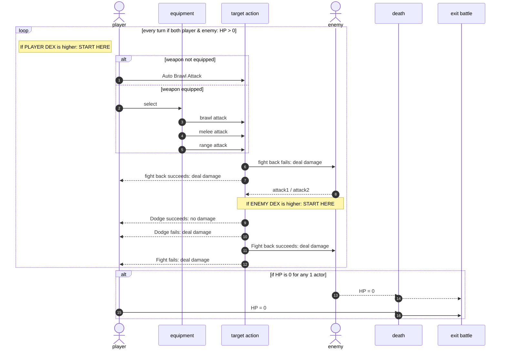

---
Battle: Fight
---

```mermaid
    sequenceDiagram
    autonumber
    actor player
    participant equipment
    participant target action
    actor enemy
    participant death
    participant exit battle

    loop every turn if both player & enemy: HP > 0
        note left of player: If PLAYER DEX is higher: START HERE
        alt weapon not equipped
        player->>target action: Auto Brawl Attack
        else weapon equipped
        player->>equipment: select
        equipment->>target action: brawl attack
        equipment->>target action: melee attack
        equipment->>target action: range attack
        end
        target action->>enemy: fight back fails: deal damage
       target action-->>player: fight back succeeds: deal damage
        enemy-->>target action: attack1 / attack2
        note over enemy, target action: If ENEMY DEX is higher: START HERE
        target action-->>player: Dodge succeeds: no damage
        target action-->>player: Dodge fails: deal damage
        target action->>enemy: Fight back succeeds: deal damage
        target action-->>player: Fight fails: deal damage
    end
    alt if HP is 0 for any 1 actor
    enemy-->>death: HP = 0
    death-->>exit battle: 
    player->>death: HP = 0
    death->>exit battle: 
    end
```

