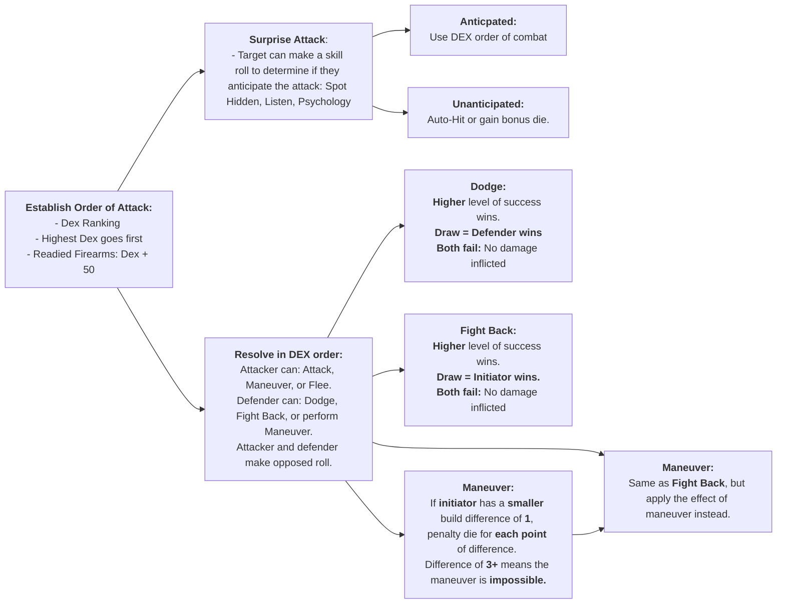
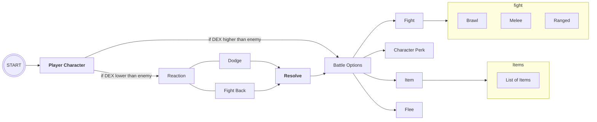
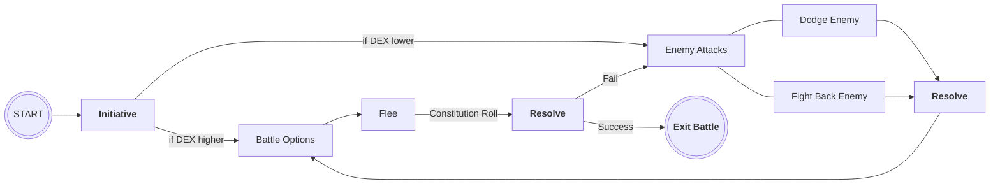
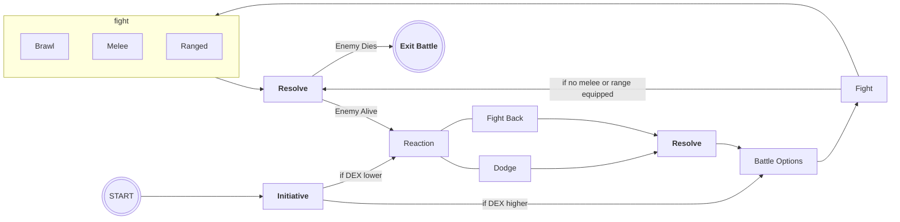
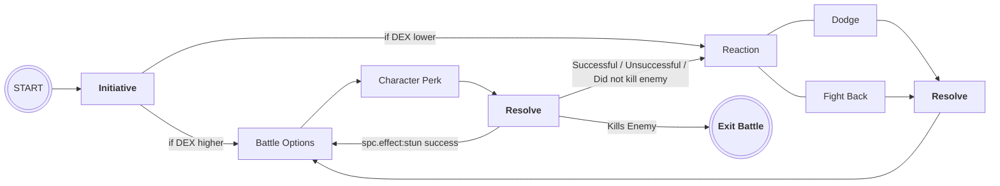

---
Original CoC Combat FlowChart
---



---
Simplified Flowchart: Player's Perspective
---



---
Simplified Flowchart: Flee Loop
---



---
Simplified Flowchart: Fight Loop
---



---
Simplified Flowchart: Perk Loop
---



---
Simplified Flowchart: Items Loop
---

```mermaid
flowchart LR
    id0(((START)))
    id1["`**Initiative**`"]

    id2[Battle Options]
    id3[Reaction]

    id2c[Item]
    id2ca[Backpack]
    id2cb["`List of Items`"]
    id2cc[Item Effect]

    id3a[Dodge]
    id3b[Fight Back]
    id4["`**Resolve**`"]


    id0-->id1
    id1-- if DEX higher -->id2
    id1-- if DEX lower -->id3
    id2-->id2c

    id2c--> Items
    subgraph Items
    id2ca-->id2cb
    end

    Items-- use items -->id2cc
    id2cc-->id3


    id3---id3a-->id4
    id3---id3b-->id4
    id4-->id2
