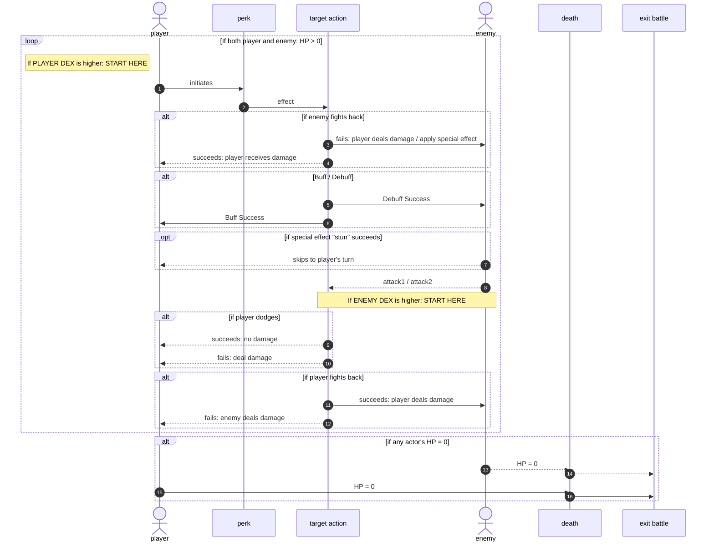

---
Battle: Character Perk
---

```mermaid
    sequenceDiagram
    autonumber
    actor player
    participant perk
    participant target action
    actor enemy
    participant death
    participant exit battle

    loop If both player and enemy: HP > 0
        note left of player: If PLAYER DEX is higher: START HERE
        player->>perk: initiates
        perk->>target action: effect
        alt if enemy fights back
        target action->>enemy:  fails: player deals damage / apply special effect
        target action-->>player: succeeds: player receives damage
        end
        alt Buff / Debuff
        target action->>enemy: Debuff Success
        target action->>player: Buff Success
        end
        opt if special effect "stun" succeeds
        enemy-->>player: skips to player's turn
        end
        enemy-->>target action: attack1 / attack2
        note over enemy, target action: If ENEMY DEX is higher: START HERE
        alt if player dodges
        target action-->>player: succeeds: no damage
        target action-->>player: fails: deal damage
        end
        alt if player fights back
        target action->>enemy: succeeds: player deals damage
        target action-->>player: fails: enemy deals damage
        end
    end
    alt if any actor's HP = 0
    enemy-->>death: HP = 0
    death-->>exit battle: 
    player->>death: HP = 0
    death->>exit battle: 
    end
```

