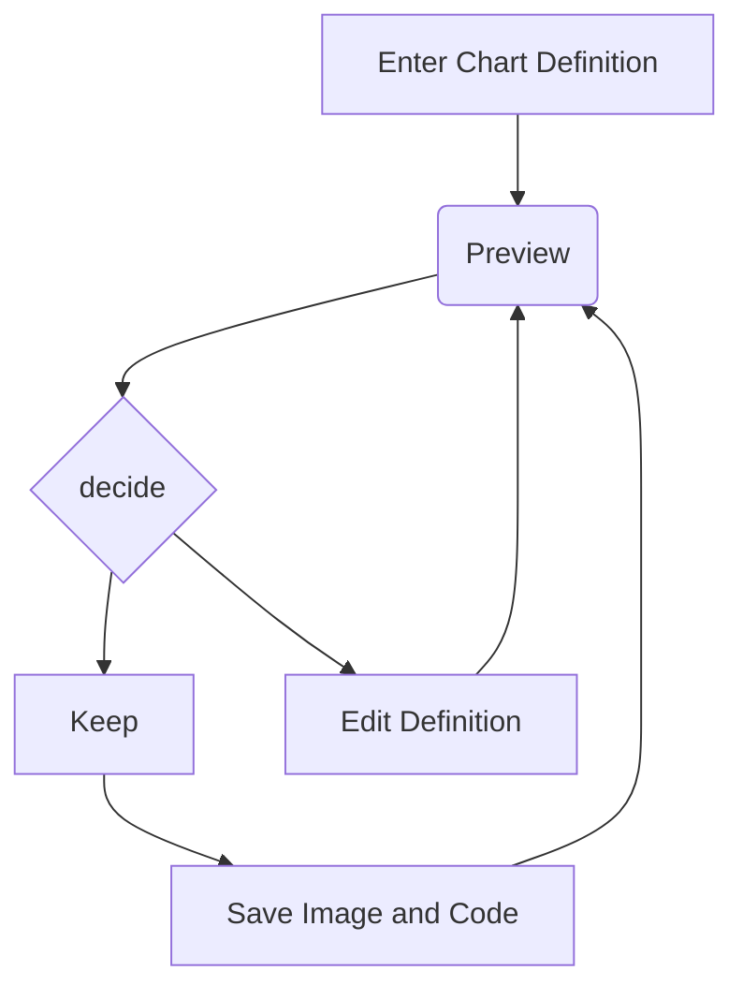

```mermaid
graph TD;
    A-->B;
    A-->C;
    B-->D;
    C-->D;
```


```mermaid
graph TD
    A[Enter Chart Definition] --> B(Preview)
    B --> C{decide}
    C --> D[Keep]
    C --> E[Edit Definition]
    E --> B
    D --> F[Save Image and Code]
    F --> B
```

---
title: battle flow
---
```mermaid
flowchart LR
    start([start])-->stop

